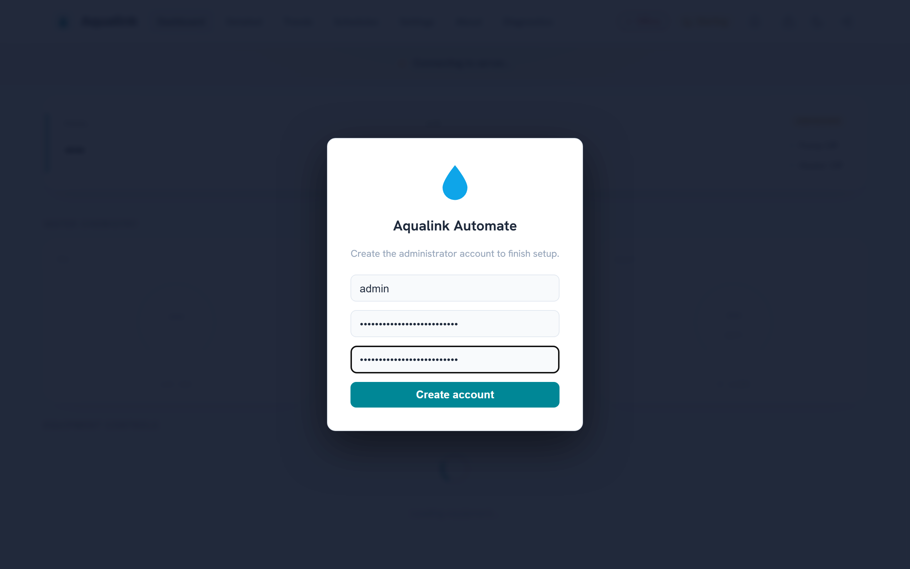
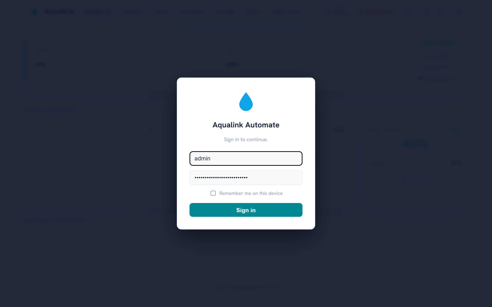
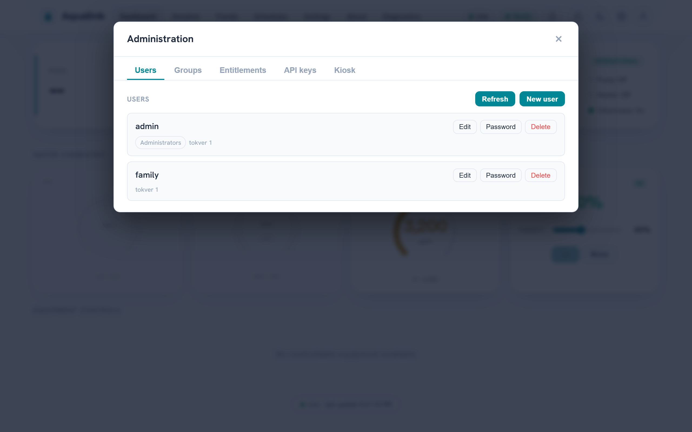
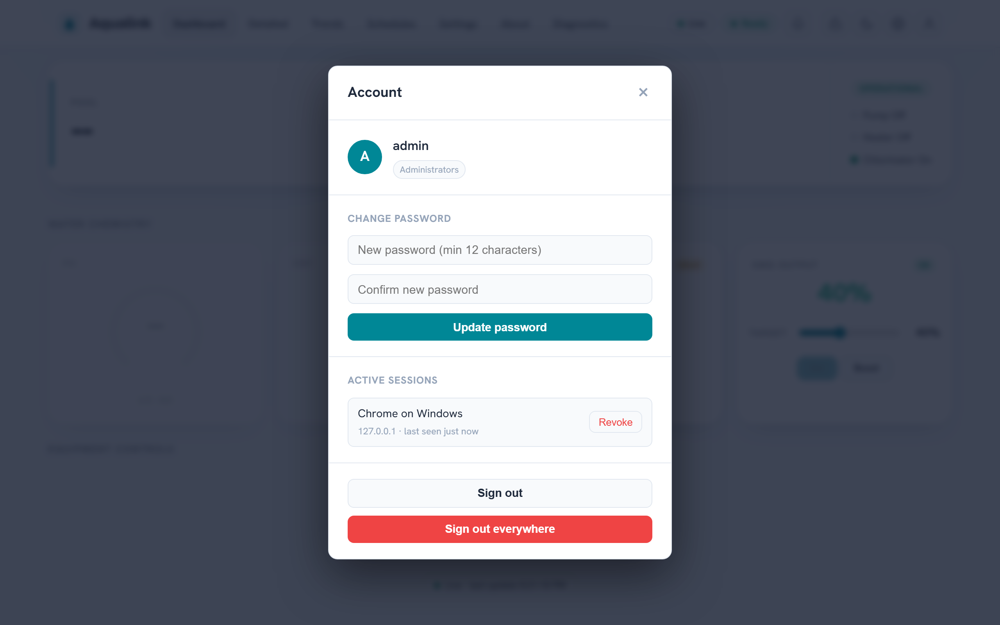

# Security policy

*For anyone deploying or evaluating Aqualink Automate. This page covers which versions get security fixes, how to report a vulnerability privately, and the deployment defaults you should know before exposing the app on a network.*

## Supported versions

Only pre-release (beta) builds exist so far — currently `v0.9.0-beta.5`. There is no stable (non-beta) release line yet, so security fixes are **not** back-ported to earlier betas; they land in development. Run a recent build from the `develop` or `main` branch.

A supported-versions table will be added here at the first stable (non-beta) release.

| Version | Supported |
| ------- | --------- |
| (none yet) | A table will appear here at the first stable (non-beta) release. |

## Reporting a vulnerability

Report security vulnerabilities **privately**. Do **not** open a public GitHub issue, pull request, or discussion for a security problem — a public report exposes the flaw to everyone before a fix exists.

Use one of these private channels instead:

1. **GitHub private vulnerability reporting (preferred).** Open the repository's **Security** tab and choose **Report a vulnerability**. This creates a private GitHub Security Advisory visible only to you and the maintainers. If you do not see the option, private reporting may not be enabled yet — use the contact method below.
2. **Direct contact.** Email the maintainer listed on the GitHub profile of the repository owner. Keep the report private; do not CC public lists.

**Important:** If you are unsure whether something is a security issue, treat it as one and use a private channel. You can always move a non-issue to a public [non-security issue](CONTRIBUTING.md) later, but you cannot un-publish a leaked vulnerability.

Expect an acknowledgement and triage through the private advisory. Fixes are incorporated into development, and the advisory is published once a fix is available.

## What to include in a report

A good report lets the maintainers reproduce and assess the issue quickly. Include:

- **Affected component** — for example the HTTP API, the WebSocket layer, MQTT publishing, or the RS-485 serial protocol parser.
- **Version or commit** — the branch and commit SHA you are running (`git rev-parse HEAD`).
- **How it was deployed** — the relevant CLI flags or config-file keys, especially the bind address (`--address`), whether API auth (`--api-auth-token`) is enabled, and whether MQTT TLS (`--mqtt-tls`) is in use.
- **Reproduction steps** — a minimal sequence, request, or input that triggers the problem.
- **Impact** — what an attacker can read, change, or disrupt.
- **Suggested remediation** — if you have one.

Do not include live credentials or private certificate keys in the report. Redact tokens and passwords.

## Deployment security defaults

Aqualink Automate ships with conservative defaults, but you should understand them before exposing the app beyond your own machine. Config-file keys are the option long name without the leading dashes (for example `--api-auth-token` becomes `api-auth-token`). The full option reference lives in [Configuration reference](configuration.md); the request-auth model is described in detail in [Usage and API](usage-and-api.md).

| Default | Behavior | How to harden |
| ------- | -------- | ------------- |
| Bind address `127.0.0.1` | The web server listens on localhost only; it is not reachable from the network. | Only change this when you intend remote access. Set `--address 0.0.0.0` (or a specific interface) to expose it, and pair that with auth and TLS. |
| API auth **off** | The HTTP API, metrics, and WebSocket are open — no credential is required. | Enable the identity system with `--auth-mode enabled` (first-run wizard creates the administrator; users, groups, API keys, and guest/kiosk scope are managed in-app — see below). The legacy shared bearer token (`--api-auth-token <token>`) remains available for simple deployments. |
| MQTT credentials in **cleartext** | Without `--mqtt-tls`, the MQTT username and password are sent unencrypted; the app logs a warning at startup. | Enable `--mqtt-tls`. The startup warning reads: `MQTT credentials configured without TLS - password will be sent in cleartext; enable --mqtt-tls`. |
| `--mqtt-tls-skip-verify` available | When set, TLS certificate verification is skipped for the MQTT connection. | **Security:** Leave this off in production. It defeats the protection TLS provides against a man-in-the-middle. Use it only for local testing against a self-signed broker. |
| HTTPS certificate **generated per install** | If no certificate is configured, the app generates a unique self-signed cert + private key on first boot (the key is written `0600`, the directory holding it is restricted to owner-only `0700`, and its SHA-256 fingerprint logged). When the install tree is read-only (the common packaged case) the material falls back to a **per-user private** directory — `$STATE_DIRECTORY` (the systemd `StateDirectory`, i.e. `/var/lib/aqualink-automate`), else `$XDG_RUNTIME_DIR`, else `$HOME/.local/state` on Linux; `%LOCALAPPDATA%` on Windows — **never** the world-writable system temp directory. The fallback directory is created owner-only and verified to be a self-owned, non-symlink directory before the key is written or an existing pair is reused, so another local user can neither read the key nor pre-seed material. No private key is shipped in the package or committed to the repo. | Supply your own trusted certificate with `--cert` / `--cert-key` (both required together), ideally from a CA your clients trust, at a persistent writable path. |

**Security:** If you set `--address 0.0.0.0` to allow remote access, enable authentication (`--auth-mode enabled`, or the legacy `--api-auth-token`) and serve over HTTPS. Binding to all interfaces with auth off exposes pool control to anyone on the network. When the app binds a non-loopback address with no `--api-auth-token`, it logs a prominent startup warning; pass `--insecure-no-auth` to acknowledge an intentionally open deployment (e.g. behind a trusted reverse proxy) and downgrade that warning. Prefer delivering secrets (`--api-auth-token`, `--mqtt-password`) via the config file (readable only by the service user) or the environment rather than the command line, where they are visible in the process table (`/proc/<pid>/cmdline`, `ps`) and shell history.

### How auth enforcement behaves

When you set `--api-auth-token`, the server requires `Authorization: Bearer <token>` on every API request, the `/metrics` endpoint, and the WebSocket upgrade. A missing or mismatched token is rejected with HTTP 401; a request that fails the Origin allow-list is rejected with HTTP 403.

```http
GET /api/equipment HTTP/1.1
Host: 127.0.0.1
Authorization: Bearer your-secret-token
```

Key points:

- **Static assets stay open** so the login screen can load before the user supplies a token. Only `/api`, `/metrics`, and the WebSocket upgrade are gated.
- **WebSocket upgrades** cannot carry an `Authorization` header from a browser, so the token may instead be supplied as a `bearer.<token>` entry in the `Sec-WebSocket-Protocol` header.
- **Origin allow-list and CSRF header** are built into the routing layer and can be enabled:
  - `--api-allowed-origin <origin>` (repeatable) — when set, an API request or WebSocket upgrade whose `Origin` header is not on the list is rejected with HTTP 403. This blocks cross-site WebSocket hijacking and cross-origin reads. Leave unset to disable the check.
  - `--api-require-csrf-header` — when set, state-changing requests (`POST`/`PUT`/`PATCH`/`DELETE`) must carry an `X-Requested-With` header, mitigating cross-site request forgery from a browser. Defaults to off so existing programmatic clients are unaffected.
- **Token strength / brute force.** The token is compared in constant time, and the routing layer applies per-IP rate limiting: after 10 failed authentication attempts from a source IP within 60 seconds, that IP is refused with HTTP 429 for the rest of the window (a successful auth clears it). This blunts online guessing, but still use a long random token (32+ characters); the app warns at startup if the configured token is shorter than 16 characters.

To require TLS for the API itself and pick certificates, see the `--cert`, `--cert-key`, and related flags in the [Configuration reference](configuration.md).

### Identity system (`--auth-mode`)

The shared-token gate above is superseded by a full identity system (design: [auth-redesign.md](auth-redesign.md)). **The identity system is fully operational as a production login flow**: the substrate (subject resolution, the entitlement vocabulary and default-deny policy engine, JWT signing-key management, the `GET /api/auth/me` probe, and the audit channel — Slice 1), local accounts with sessions, an in-app administration surface (users, groups, entitlements, API keys), and headless bootstrap (Slice 2), and anonymous Guest scope with kiosk PIN elevation (Slice 3). In-app OIDC and reverse-proxy forward-auth are designed but **not yet implemented** — see [auth-redesign.md](auth-redesign.md).

With `--auth-mode enabled` and an empty user store, the web UI walks you through creating the first administrator:



Afterwards, visitors sign in from the login card (or browse anonymously under whatever entitlements the built-in Guest group grants):



Postures (`--auth-mode`, default `disabled`; see the [Configuration reference](configuration.md)):

- **`disabled` (default)** — no identity resolution; every policy decision is Permit. Behaviour is exactly the historical model described above, including the optional shared bearer token (`--api-auth-token`).
- **`enabled`** — every request is resolved to a *subject* (from a Bearer JWT, or anonymous) and each route's declared entitlement is checked by the policy engine (ABAC, default deny). An **anonymous request resolves to the built-in Guest group**, which starts with **no entitlements** — deny-by-default until an administrator grants guest scope (edit the Guest group in the Administration UI or via `POST /api/groups`). The legacy `--api-auth-token` shared-token check is then **superseded**: bearer credentials are interpreted by the subject resolver (as a JWT) rather than compared against the shared token; a configured legacy token folds in as a pre-seeded bootstrap API key (see Slice 2 below). The Origin allow-list and CSRF-header checks continue to apply unchanged.

Enforcement semantics with `--auth-mode enabled`:

- A denied request answers **`401 Unauthorized`** when the subject is **anonymous** (logging in could elevate it) and **`403 Forbidden`** when the subject is **authenticated but not entitled**.
- The non-enumeration rule is retained: an unauthenticated probe of an **unknown `/api/*` path** answers `401` (not `404`), so the route surface cannot be mapped without credentials.
- `GET /api/auth/me` deliberately declares **no entitlement requirement**, so an anonymous/guest caller can always ask "who am I and what may I do?" — see [Usage and API](usage-and-api.md).

Supporting infrastructure shipped with Slice 1:

- **Trusted-proxy client identity.** `X-Forwarded-For` is honoured **only** when the connecting peer is inside a configured trusted-proxy CIDR (`SecurityConfig::TrustedProxyCidrs` in the routing layer); from any other source the header is ignored, so an untrusted client can neither spoof its way out of a rate-limit bucket nor put someone else into one. The CLI flag to configure the trusted CIDRs arrives with the forwarded-auth (proxy) slice; until then the list is empty and `X-Forwarded-For` is always ignored.
- **JWT signing keys.** Session tokens are signed with keys held in `jwt-signing.key` inside the auth state directory — `--auth-state-dir`, or by default an `auth/` subdirectory of the platform's secure state directory (the same owner-only `0700` fallback chain as the generated TLS key). The key file itself is written `0600`. Each key carries a `kid` stamped into the token header; rotation installs a fresh active key while keeping the previous one valid, so tokens issued just before a rotation still verify during their lifetime.
- **Audit channel.** A dedicated `Audit` logging channel with an OS-native sink — syslog on POSIX (picked up by journald on systemd distributions), the Windows Event Log on Windows — plus a structured JSONL audit file in the state directory (owner-only, size-rotated; it feeds the future in-app audit viewer and is the durable trail when no OS sink is available). Auditable events flow whenever `--auth-mode` is enabled: control actions with their policy decision, login success/failure, lockouts, token/key issuance and revocation, and entitlement/group changes.

### Sessions and local accounts (Slice 2)

Slice 2 adds the local-account login flow and the admin management surface on top of the Slice 1 substrate. With `--auth-mode enabled`, `POST /api/auth/login` verifies a username/password and issues a session; the endpoints and their entitlement gates are catalogued in [Usage and API](usage-and-api.md). An administrator manages users, groups, entitlements, API keys, and the kiosk PIN from the in-app Administration overlay:



- **Session model.** A successful login returns a **short-lived access JWT** (default 15 minutes, `--jwt-access-ttl`) carrying the subject's resolved entitlements, plus a longer-lived **opaque refresh token**. The access token is presented as `Authorization: Bearer <jwt>` on every request; the refresh token is exchanged at `POST /api/auth/refresh` for a fresh pair. Refresh tokens are **single-use and rotate on every exchange** — each rotation mints a new secret and remembers the previous one. Presenting a rotated-out (already-used) refresh token is the classic stolen-token signature, so it **revokes the whole session** and is recorded loudly on the audit trail. Only the SHA-256 digest of each refresh secret is stored; the secret itself is returned once.
- **Immediate revocation via token version.** Each account carries a `tokver` counter. Password change, disable, and logout-everywhere (`POST /api/auth/logout` with `everywhere`) all **bump `tokver`**, which instantly invalidates every outstanding access token for that user (the subject resolver cross-checks `tokver` on each request) as well as revoking the refresh sessions. The revocation also propagates to **live WebSocket connections**, which are closed on their next poll so the client must reconnect with fresh credentials. Entitlement/group changes bump `tokver` too, so access tokens go stale within one request while still-valid refresh tokens re-mint with the new grants — a grant change never forces a re-login.
- **Password hashing off the kernel thread.** Passwords are hashed with **argon2id** (libsodium `crypto_pwhash_str`). argon2id is deliberately slow, and the app's cooperative single-threaded loop also drives the RS-485 bus, so every hash/verify runs on a worker offload pool and never blocks the protocol loop. Unknown usernames are verified against a pre-computed decoy hash so login timing does not reveal whether an account exists.
- **Login lockout.** In addition to the per-IP rate limiter in the routing layer, failed logins are counted **per account**: 5 failures against one username lock that account's login for 15 minutes (`429`, `Retry-After: 900`), independent of the source IP. This survives an attacker rotating IPs behind a proxy.
- **Password policy.** The single rule enforced everywhere a password is set (setup, admin create, password change) is a **minimum length of 12 characters**; there are no composition rules (length beats complexity).
- **First-run setup and headless bootstrap.** When `--auth-mode enabled` and the user store is empty, the system has no owner. Either the first-run setup screen posts to `POST /api/auth/setup` to create the first administrator, or `--bootstrap-admin <username>` does so headlessly at startup. Both funnel through one idempotent path: **once any user exists, setup is sealed** — `/api/auth/setup` answers `403` and a stray `--bootstrap-admin` flag is a no-op, so an extra admin can never be minted after ownership is established. The bootstrap password is read from the first line of `--bootstrap-admin-password-file` or the `AQUALINK_BOOTSTRAP_ADMIN_PASSWORD` environment variable — **never a bare command-line argument**, which would be visible in the process table.
- **API keys.** Machine credentials for the HTTP API are created by an administrator, **entitlement-scoped**, optionally expiring, and **shown exactly once** at creation (`aak_...`); only their SHA-256 digest is stored, so a lost secret cannot be recovered — only revoked. The legacy `--api-auth-token`, when configured under `--auth-mode enabled`, is **folded in as a pre-seeded bootstrap key** with `system.admin` scope, so existing deployments keep working with their configured secret.
- **Secrets at rest.** JWT signing keys, the user/group/API-key/session stores, and per-user preference overrides all live as owner-only files in the auth state directory (`--auth-state-dir`, or the platform's secure `0700` state directory by default); the signing key file is written `0600`.

Signed-in users manage their own credential from the Account menu — password change, the active-session list with per-device revocation, and sign-out-everywhere:



### Guest scope and kiosk PIN (Slice 3)

Slice 3 covers anonymous visitors and shared terminals:

- **Guest scope.** An anonymous request resolves to the built-in **Guest** group, which starts with **no entitlements** (a login wall). Granting Guest `equipment.view` lets anonymous visitors browse the dashboard read-only, with login-to-elevate still available; the group is edited like any other from the Administration overlay or `POST /api/groups`. The Guest group cannot be deleted.
- **Kiosk PIN elevation.** For a poolside tablet or wall panel, an administrator can configure a short numeric PIN (`PUT /api/kiosk`, min 4 digits, argon2id-hashed off-thread) that elevates the terminal into an admin-chosen target group without exposing a real account's password. Kiosk sessions are ordinary revocable JWT sessions but carry no per-user preferences; disabling the kiosk or replacing the PIN immediately drops outstanding kiosk sessions back to the Guest scope. Wrong-PIN attempts share the account-lockout treatment (`429` with `Retry-After`).

The route-level detail (including `GET /api/auth/me`'s `kiosk_enabled` flag the login screen keys off) is in [Usage and API](usage-and-api.md).

## Policy adoption

This security policy is adapted from common open-source practice. Aqualink Automate is licensed under the GNU General Public License v3 (see [LICENSE.txt](https://github.com/iainchesworth/aqualink-automate/blob/main/LICENSE.txt)).

Suggestions to improve this policy are welcome — raise them as a **non-security** issue or pull request through [CONTRIBUTING.md](CONTRIBUTING.md). Keep actual vulnerability reports on the private channels described above.
