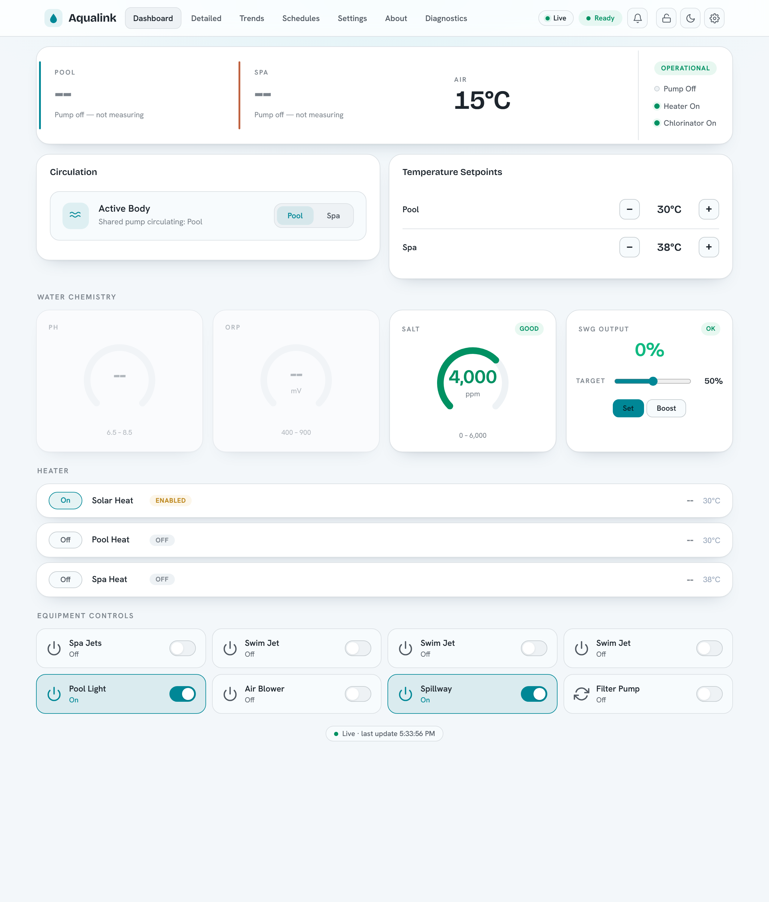

# Aqualink Automate

Local control of Jandy/Zodiac (Fluidra) Aqualink RS and Pentair pool controllers
over RS-485 — Web UI, HTTP API, MQTT, and a Matter bridge, with **no cloud
service required**.

Aqualink Automate is a C++ service that talks to your pool equipment over an
RS-485 serial link and exposes it on your own network. It reads status from the
panel and lets you control it through a built-in Web UI, an HTTP and WebSocket
API, MQTT (with Home Assistant discovery), and a Matter bridge for Apple Home,
Google Home, Alexa, and SmartThings. The web UI is available in nine languages
(with full right-to-left support), and [community translations are easy to
add](CONTRIBUTING.md#contributing-translations). Everything runs on hardware
you own; nothing is sent to a vendor cloud.



## Install

The quickest path is the signed package repositories — install and stay current
with your system package manager:

=== "Debian / Ubuntu / Raspberry Pi OS"

    ```bash
    curl -fsSL https://iainchesworth.github.io/aqualink-automate/install-apt.sh | sh
    sudo apt install aqualink-automate
    ```

=== "Fedora / RHEL / openSUSE"

    ```bash
    curl -fsSL https://iainchesworth.github.io/aqualink-automate/install-dnf.sh | sh
    sudo dnf install aqualink-automate
    ```

Then `sudo apt upgrade` / `sudo dnf upgrade` keeps it current. Builds are provided
for `amd64` and `arm64` (Raspberry Pi). The repositories are GPG-signed with
[this key](https://iainchesworth.github.io/aqualink-automate/key.gpg).

For pre-built binaries, dev containers, Docker, and building from source, see the
[Install guide](INSTALL.md).

!!! warning "Before exposing it on your network"

    By default the web server binds to `127.0.0.1` (localhost only) and
    authentication is off. Enable the built-in identity system with
    `--auth-mode enabled` (first-run wizard, users/groups, API keys, guest and
    kiosk access), and review the [Security guide](SECURITY.md) and the
    [Configuration reference](configuration.md) first.

## Where to next

- **[Install](INSTALL.md)** — releases, Docker, dev container, build from source.
- **[Configuration](configuration.md)** — every CLI flag and config-file key.
- **[Usage, HTTP API & WebSocket](usage-and-api.md)** — drive it programmatically.
- **[MQTT & Home Assistant](mqtt-home-assistant.md)** — auto-discovery and topics.
- **[Matter](MATTER.md)** — pair the pool into Apple Home, Google Home, Alexa, SmartThings.
- **[Raspberry Pi](raspberry-pi.md)** — run it on a Pi.
- **[RS-485 wiring](hardware-rs485-connectivity.md)** — adapters and physical connection.

Contributors should start with the [Development](CONTRIBUTING.md) section.

## Supported equipment

Two RS-485 protocols are supported and auto-detected from the wire traffic:
**Jandy/Zodiac (Fluidra) Aqualink RS** and **Pentair**. The
[GitHub repository](https://github.com/iainchesworth/aqualink-automate) has the
full source, issue tracker, and changelog.

## Questions and support

- **Bugs and feature requests** — open an [issue](https://github.com/iainchesworth/aqualink-automate/issues).
- **Questions, ideas, and help** — start a [GitHub Discussion](https://github.com/iainchesworth/aqualink-automate/discussions).
