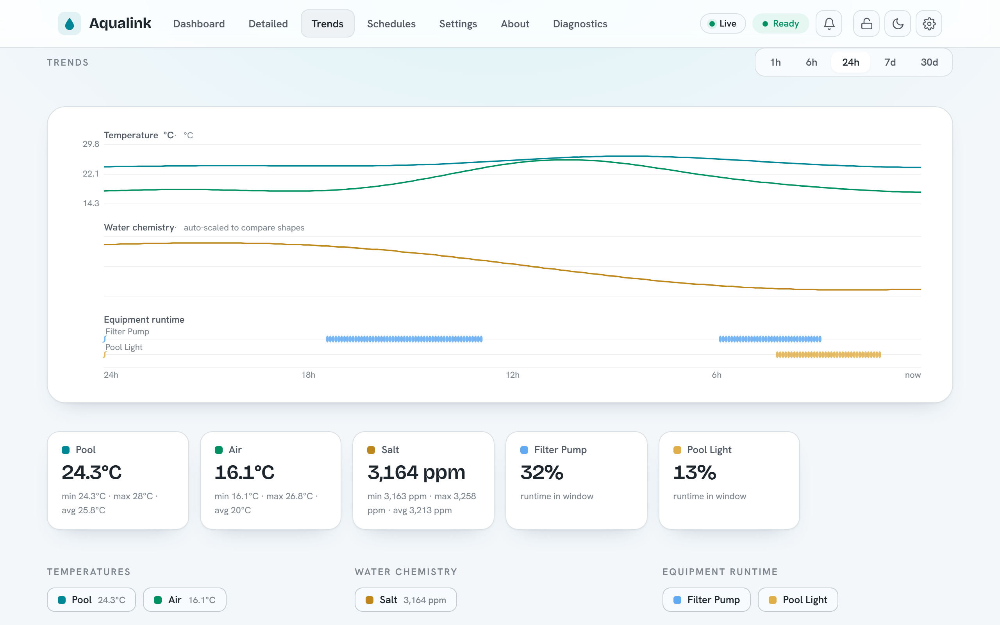
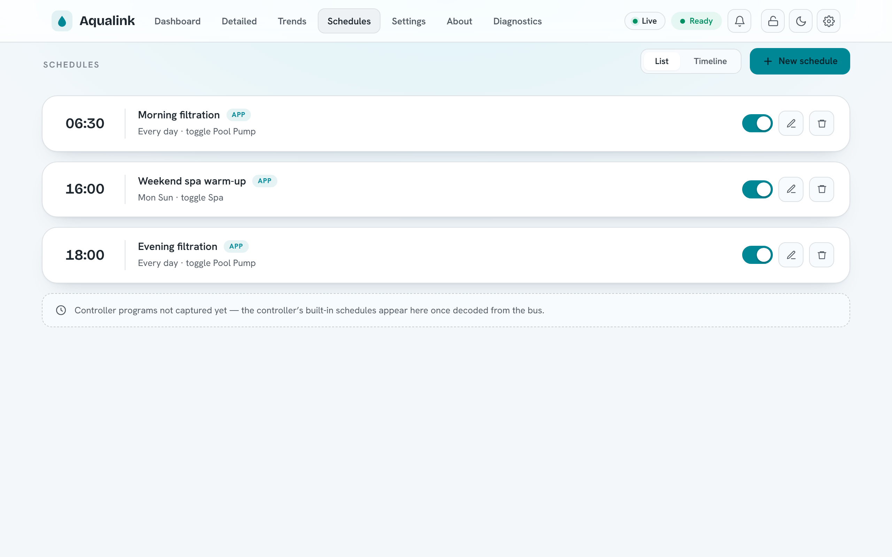
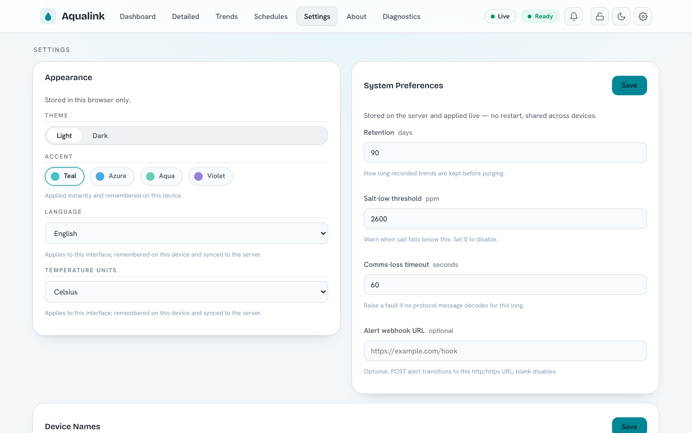
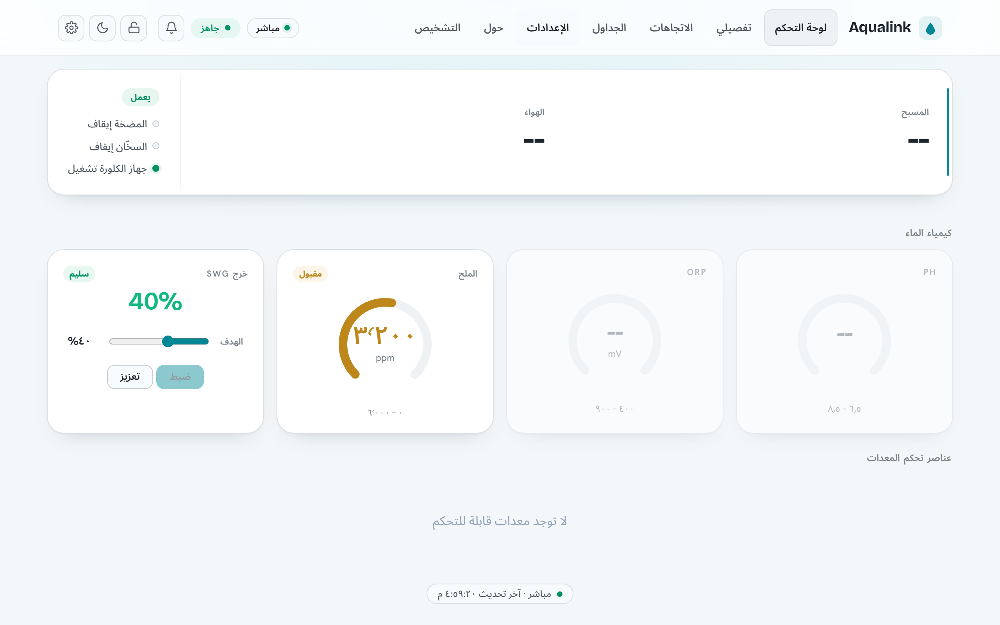
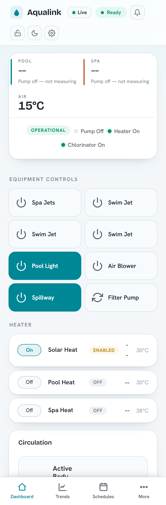
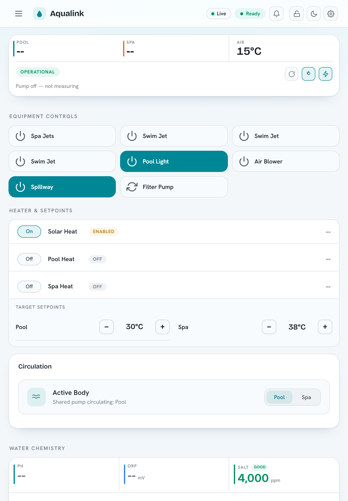

# Usage, HTTP API and WebSocket protocol

*For pool owners running a release build who want to control or monitor the system over HTTP. The machine-readable companion is [swagger.yaml](https://github.com/iainchesworthlabs/aqualink-automate/blob/main/assets/web/api/swagger.yaml); CLI flags live in the [Configuration reference](configuration.md); building from source lives in [INSTALL.md](INSTALL.md).*

This document covers how to run the application, the built-in web UI, the complete HTTP REST API, and the WebSocket protocol the UI uses for live updates. Routes are documented as the code registers them today — the same source of truth `swagger.yaml` is generated against.

## Contents

- [Quickstart: first run](#quickstart-first-run)
- [The web UI](#the-web-ui)
- [Security model](#security-model)
- [HTTP API conventions](#http-api-conventions)
- [Route reference by tag](#route-reference-by-tag)
- [Key request and response examples](#key-request-and-response-examples)
- [WebSocket protocol](#websocket-protocol)
- [Prometheus metrics](#prometheus-metrics)
- [Viewing the API spec](#viewing-the-api-spec)

## Quickstart: first run

The application talks to the AquaLink panel over RS-485 — either a local serial port or a remote serial bridge — and serves a web UI plus REST/WebSocket API. Pick the connection that matches your hardware.

**Connect to a local serial port.** Use this when the RS-485 adapter is plugged into the machine running the app.

```bash
# Linux: an FTDI/CH340-style USB RS-485 adapter shows up as /dev/ttyUSB0
aqualink-automate --serial-port /dev/ttyUSB0
```

```powershell
# Windows: the adapter shows up as a COM port
aqualink-automate.exe --serial-port COM3
```

**Connect to a remote serial bridge.** Use this when the panel is wired to a networked RS-485-over-TCP device (for example a Brainboxes or other RFC 2217 gateway). Pass `--rfc2217` when the bridge speaks the RFC 2217 control protocol.

```bash
aqualink-automate --remote-serial-port 192.168.1.50:9001 --rfc2217
```

**Open the web UI.** The web server binds to `127.0.0.1` by default — reachable only from the same machine. To reach it from your LAN, bind a routable address and choose a port:

```bash
aqualink-automate --serial-port /dev/ttyUSB0 --address 0.0.0.0 --http-port 8080
# Then browse to http://<host-ip>:8080/
```

**Security:** The bind address defaults to `127.0.0.1` and authentication is off by default. Binding to `0.0.0.0` exposes an unauthenticated control surface to your whole network. Turn on a bearer token (see [Security model](#security-model)) before exposing the server, and prefer HTTPS. See the [Configuration reference](configuration.md) for `--address`, `--http-port`, and TLS options.

CLI flags and the optional config file share names: a config-file key is the option's long name without the leading dashes (for example the flag `--http-port` is the key `http-port`).

## The web UI

The UI is a static single-page application built on Alpine.js. The server ships it from the document root (override with `--doc-root`), and your browser drives everything from there — there is no server-side rendering.

On load the page:

1. Loads the vendored `alpine.min.js` and Chart.js (vendored as `chart.umd.min.js`) — no external CDN.
2. Calls `auth.check()`, which issues `GET /api/auth/check`. A `200` means you are allowed in (either auth is disabled or your stored token is valid); a `401` shows the login screen.
3. Runs `fetchInitial` (a batch of REST reads) to paint the current state, then opens the live WebSocket connections.
4. Falls back to polling REST every 30 seconds whenever the WebSocket is down, so the UI keeps updating even if the live channel drops.

The WebSocket client opens `/ws/equipment` and `/ws/equipment/stats`, matching the page protocol (`ws://` for HTTP, `wss://` for HTTPS). It reconnects with exponential backoff from 1 s up to 30 s. When a token is stored it is attached as the `['aqualink', 'bearer.<token>']` WebSocket subprotocols.

Beyond the main dashboard (pictured in the [README](https://github.com/iainchesworthlabs/aqualink-automate/blob/main/README.md)), the UI includes a Trends view over the recorded history (`--history-db`), a Schedules view for the app scheduler (`--schedules-file`), and a Settings view combining per-browser appearance options with server-side system preferences:







### Languages

The web UI ships in nine languages — English, German, Spanish, French, Arabic, Hebrew, Japanese, Simplified Chinese, and Yiddish — selected under **Settings → Appearance → Language** (the available languages are also listed on the About page). By default the UI follows the browser's language; an explicit choice is stored locally for instant boot and mirrored to the server under `preferences.ui.locale`, so it follows you across devices.

Right-to-left languages (Arabic, Hebrew, Yiddish) mirror the layout automatically, and numbers, dates, and temperatures format per the active locale — Arabic renders Eastern Arabic-Indic digits, and temperatures follow the °C/°F display-units preference everywhere, including the Trends charts.



Translations live in plain-text catalogs and are easy to contribute — see [Contributing translations](CONTRIBUTING.md#contributing-translations) for the workflow and [docs/i18n.md](i18n.md) for the mechanics.

### Responsive layout

The UI is a single responsive web app — there is no separate mobile build or native app. The same page reflows across three viewport bands, and the navigation adapts to match:

| Width | Band | Navigation |
|---|---|---|
| `< 640px` | Phone | A fixed **bottom tab bar** (Dashboard · Trends · Schedules · More); secondary destinations live behind **More**, which opens a bottom sheet — a grouped menu with per-row icons, drill-in chevrons, and toggle switches for dark mode and monitor-only mode. |
| `640–1023px` | Tablet | The inline links collapse behind a **hamburger** button that opens a nav drawer. |
| `≥ 1024px` | Desktop | The full **inline navigation** in the top bar. |

On phones the dashboard reorders and consolidates itself around what you act on most: a condensed Pool/Spa/Air temperature header; equipment as two-up **tap-tiles** (tap to toggle; a tile fills with the accent colour when its device is on); the heater rows with the temperature-setpoint steppers folded in beneath them; and the water chemistry collapsed into a single card — pH, ORP and salt as an accent-striped row with the salt-water generator output and controls below. The top bar condenses to one row (brand, live/ready status, alerts), with the theme and other toggles moving into the **More** sheet. Tablet portrait keeps the richer multi-column card grid — circular chemistry dials, a standalone setpoints card — under the hamburger; tablet landscape and desktop use the full inline layout. Modals become full-width bottom sheets on phones and centred dialogs on wider screens. On compact layouts the dense **Diagnostics** page also collapses to the essentials (System Health, serial-port utilisation, bandwidth, message errors, communication latency); the heavier power-user sections — device list, message statistics, MQTT broker, log levels and serial recording — fold behind a **Show advanced diagnostics** disclosure, while desktop keeps the full page.

<p align="center">
  
  &nbsp;&nbsp;
  
</p>

The layout is regression-tested at every band by `e2e/responsive.spec.ts`, which asserts the correct navigation pattern, no horizontal overflow, RTL mirroring, and dark-mode heading contrast across the phone/tablet/desktop viewports.

## Security model

Authentication is **opt-in** and **off by default**. With no token configured the server behaves exactly as an open, unauthenticated service — every route is reachable without credentials.

To require authentication, set a bearer token via `--api-auth-token <token>` (config key `api-auth-token`). When a token is configured:

- **Registered routes** (everything under `/api`, plus `/metrics`) and any **unmatched `/api/*` path** require an `Authorization: Bearer <token>` header. The token is compared in constant time. A missing or wrong token returns `401 Unauthorized`. An unknown `/api/*` path answers `401` (not `404`) so the existence of routes is not leaked.
- **Static assets are intentionally served without authentication.** This is deliberate: the browser must be able to load `index.html`, scripts, and CSS to render the login screen before the user has a token.
- **`GET /api/health` is intentionally served without authentication.** The liveness probe must be reachable by a container/orchestrator health check without baking in the operator's token. It returns only `{"status":"ok","uptime_seconds":N}` — no sensitive data. The richer `GET /api/health/detailed` is **not** exempt: it exposes internal subsystem state and is gated by the bearer-token policy like every other route.
- **WebSocket upgrades are gated by the same policy.** Browsers cannot set an `Authorization` header on a WebSocket upgrade, so the token rides in the `Sec-WebSocket-Protocol` header as a `bearer.<token>` entry alongside the `aqualink` marker (for example `Sec-WebSocket-Protocol: aqualink, bearer.<token>`). On success the handshake echoes back the `aqualink` subprotocol.

Two further hardening layers are built into the routing layer and are exposed via CLI flags / config keys (see the [Configuration reference](configuration.md)):

- **Origin allow-list.** Set one or more allowed origins with the repeatable `--api-allowed-origin` flag (config key `api-allowed-origin`). When at least one origin is configured, a request or WebSocket upgrade whose `Origin` header is not on the list is rejected with `403 Forbidden`.
- **CSRF header.** Enable `--api-require-csrf-header` (config key `api-require-csrf-header`) so that state-changing methods (`POST`, `PUT`, `DELETE`, …) must send an `X-Requested-With` header or they are rejected with `403 Forbidden`. This check does not apply to the WebSocket upgrade, which is always a `GET`.

**Security:** A token over plain HTTP travels in cleartext. Pair `--api-auth-token` with HTTPS (see the TLS options in the [Configuration reference](configuration.md)) whenever the server is reachable beyond `localhost`.

### Identity system (`--auth-mode`)

Beyond the shared token, an opt-in identity system is available (design: [auth-redesign.md](auth-redesign.md); enforcement model: [SECURITY.md](SECURITY.md)). With `--auth-mode enabled`, every request resolves to a *subject*, and each route declares the **entitlement action** it requires — drawn from the v1 vocabulary in [auth-redesign.md §4](auth-redesign.md) (`equipment.view`, the `equipment.control.*` family, `schedules.view`/`schedules.edit`, `diagnostics.view`, `prefs.self`, `system.admin`) — which a default-deny policy engine checks on every request; routes with per-resource grain (e.g. `POST /api/equipment/buttons/{button_id}`) are checked against the specific resource id in the path, so selector-scoped grants like `equipment.control.aux:AUX3` are enforced by the router. A denied request answers `401` when the subject is anonymous and `403` when it is authenticated but not entitled; an unknown `/api/*` path still answers `401` for an unauthenticated subject (no route enumeration). When `--auth-mode enabled`, the legacy `--api-auth-token` shared-token check is superseded — bearer credentials are interpreted by the subject resolver instead. The login and administration flows are fully implemented: username/password sessions with refresh rotation ([Sessions](#sessions-slice-2)), guest browsing and kiosk PIN elevation ([Guest mode](#guest-mode)), and user/group/entitlement/API-key management ([Administration](#administration)). Anonymous callers carry the built-in Guest group's entitlements — empty by default, deny until granted.

## HTTP API conventions

- **Base paths.** Application routes live under `/api`. Two endpoints are exceptions: `GET /metrics` lives at the **root** (not under `/api`), and the web UI / static assets are served from `/`.
- **No caching of dynamic responses.** Every registered (dynamic) route response is stamped `Cache-Control: no-store`. Static assets are not, so they cache normally.
- **Request body limit.** HTTP request bodies are capped at **10000 bytes**. A larger body is rejected before your handler runs.
- **Connection limits.** The server accepts at most **1000** concurrent HTTP connections and applies a **30-second** per-operation idle timeout.
- **Method dispatch.** Each route dispatches on the HTTP method. An unsupported method returns `405 Method Not Allowed`. Some routes return a bare `405`; others (the diagnostics routes) return `405` with a JSON body such as `{"error":"Method not allowed. Use GET."}`.
- **Content types.** JSON responses use `application/json`. Validation and method errors are usually `text/plain` or a small JSON `{"error":"..."}` object, depending on the route (noted per route below).

**Note:** In replay/dev mode the system has no live serial adapter, so command (`POST`) routes commonly answer `503` while `PoolConfiguration` is `Unknown`. This is a documented, accepted outcome — treat it as "not ready", not a server fault.

## Route reference by tag

All routes below are registered in a single block when the web server is enabled. URLs are compile-time constants.

### Health

| Method | Path | Success | Notes |
|---|---|---|---|
| GET | `/api/health` | `200` `{"status":"ok","uptime_seconds":N}` | **Liveness** probe for Docker/Kubernetes health checks. **Always unauthenticated** (reachable without the bearer token even when `--api-auth-token` is set); carries no sensitive data. The Docker image ships a `HEALTHCHECK` that polls it. |
| GET | `/api/health/detailed` | `200` JSON / `503` when not ready | **Readiness + diagnostics**: overall readiness, uptime, version, and per-subsystem checks (configuration + equipment validation, equipment count, MQTT connectivity). Returns `200` once the pool configuration is known, `503` while still starting. **Subject to the bearer-token policy** (it exposes internal state). Serial/protocol counters are not duplicated here — see `/metrics`. |

### Version

| Method | Path | Success | Notes |
|---|---|---|---|
| GET | `/api/version` | `200` JSON | App + build metadata and uptime. `git_info.uncommitted_changes` is the build-time working-tree state and means a **tracked source file differed from the commit** — it deliberately ignores exec-bit-only changes, untracked build artifacts, and the bootstrapped `deps/vcpkg` submodule, so a CI-released binary reports `false`. |

### Equipment

| Method | Path | Success | Other codes |
|---|---|---|---|
| GET | `/api/equipment` | `200` JSON | Full state block (temperatures, chemistry, configuration, devices, stats, version). |
| GET | `/api/equipment/devices` | `200` JSON | Devices grouped as `auxillaries`, `heaters`, `pumps`. |
| GET | `/api/equipment/version` | `200` JSON | `fields[]`, `model_number`, `fw_revision`. |
| POST | `/api/equipment/circulation` | `200` JSON | Set circulation mode (`pool`/`spa`/`spillover`). `400` (bad value), `409` (a capable controller is still applying an earlier command -- retry shortly), `503` (no dispatcher / no commandable controller). POST-only; non-`POST` returns a bare `405`. |
| POST | `/api/equipment/heater` | `200` JSON | Enable/disable a heater by body of water (`pool`/`spa`/`solar`). `400` (bad value), `409` (controller busy -- retry shortly), `503` (no dispatcher / no commandable controller). POST-only; non-`POST` returns a bare `405`. |

### Buttons

| Method | Path | Success | Other codes |
|---|---|---|---|
| GET | `/api/equipment/buttons` | `200` JSON | List of buttons with `controllable` flag. |
| POST | `/api/equipment/buttons` | `200` empty `text/html` | Placeholder (no-op). |
| GET | `/api/equipment/buttons/{button_id}` | `200` JSON | `503` (system not ready), `404` (bad/unknown id). |
| POST | `/api/equipment/buttons/{button_id}` | `200` JSON (toggled) | `503`, `409` (controller busy -- retry shortly), `404`, `422`, `400` (see below). |

### Devices

| Method | Path | Success | Notes |
|---|---|---|---|
| GET | `/api/equipment/iaq` | — | POST only (see Setpoints/commands). |
| POST | `/api/equipment/iaq` | `200` JSON | `select_button` (0..255). `503` no dispatcher / no commandable device, `409` controller busy (retry shortly), `400` bad value. |
| GET | `/api/equipment/spaside-remotes` | `200` JSON | `remotes`, `assignments`, `requested`. |
| POST | `/api/equipment/spaside-remotes` | `200` JSON | `press` / `assign` actions (see below). |

### Setpoints

| Method | Path | Success | Other codes |
|---|---|---|---|
| GET | `/api/equipment/setpoints` | `200` JSON | `pool_setpoint`, `spa_setpoint`. |
| POST | `/api/equipment/setpoints` | `200` JSON | `400` (bad value), `503` (no dispatcher), `500` (dispatch failed, including a controller that is busy applying an earlier command -- retry shortly). |
| POST | `/api/equipment/chlorinator` | `200` JSON | `400` (bad body), `409` (a capable controller is still applying an earlier chlorinator command -- retry shortly), `503` (no dispatcher / no commandable chlorinator). |

### Diagnostics

| Method | Path | Success | Notes |
|---|---|---|---|
| GET | `/api/diagnostics/emulated-devices` | `200` JSON | Per-device diagnostics array (emulated). |
| GET | `/api/diagnostics/actual-devices` | `200` JSON | Per-device diagnostics array (bus-discovered). |
| GET / POST | `/api/diagnostics/logging` | `200` JSON | GET returns channels + levels; POST sets a level. |
| GET | `/api/diagnostics/options` | `200` JSON | `options[]` of `{name, short_name, description}`. |
| GET | `/api/diagnostics/mqtt` | `200` JSON | `enabled` + MQTT connection diagnostics. |
| GET | `/api/diagnostics/matter` | `200` JSON | `enabled` + Matter sidecar status (cached). |
| GET / POST | `/api/diagnostics/recording` | `200` JSON | GET returns `{recording, file, bytes}`; POST starts/stops. `400` bad body / rejected filename; `409` already/not recording; `503` no recorder (dev-mode/replay). |
| GET | `/api/diagnostics/recording/captures` | `200` JSON | `captures[]` of `{name, bytes, modified}` — the finished captures on the server, newest first. |
| GET | `/api/diagnostics/recording/captures/{filename}` | `200` file | Downloads one capture (`Content-Disposition: attachment`). `400` rejected filename; `404` unknown capture; `413` larger than the 64 MiB download limit. |
| GET / POST | `/api/diagnostics/profiling` | `200` JSON | GET reports `{enabled, running, backend, available}`; POST controls it (`start`/`stop`/`select`). `400` (bad body), `409` (no backend in this build), `503` (no controller). |

Non-`GET` requests to the read-only diagnostics routes return `405` with a JSON body.

**Captures.** A recording started through `POST /api/diagnostics/recording` is written into the server's capture directory (`--capture-directory`, default `<cwd>/captures`). The client-supplied `filename` must be a bare `*.cap` basename and is jailed into that directory; the download route applies the **same** jail to its `{filename}`, so neither endpoint can reach a file elsewhere on the host. Only basenames are ever reported — the server-side directory is not disclosed. The listing reports only what the download route would serve (regular files, never symlinks), and `modified` is seconds since the Unix epoch. All three routes require `diagnostics.view` for `GET` (`system.admin` for the recording `POST`), like every other diagnostics route. See [Serial record / replay](RECORD_REPLAY.md).

### History

| Method | Path | Success | Other codes |
|---|---|---|---|
| GET | `/api/history/series` | `200` JSON | `503` when history is disabled; `404` unknown key; `400` if `to` < `from`. |

### Schedules

| Method | Path | Success | Other codes |
|---|---|---|---|
| GET | `/api/schedules` | `200` array | `503` when scheduler disabled. |
| POST | `/api/schedules` | `201` JSON | `400` invalid body; `503` disabled. |
| GET | `/api/schedules/{uuid}` | `200` JSON | `404` unknown; `503`; `400` missing uuid. |
| PUT | `/api/schedules/{uuid}` | `200` JSON | `400`, `404`, `503`. |
| DELETE | `/api/schedules/{uuid}` | `204` | `404`, `503`. |
| POST | `/api/schedules/{uuid}/promote` | `200` `{status:"queued", schedule}` | `404` unknown; `409` a capable writer is busy applying an earlier program change (retry shortly); `422` no on/off complement or non-button action; `400` not representable (`blockers[]`); `503`. |
| GET | `/api/controller/schedules` | `200` `{status, active_group, schedules[]}` | `503` when the store is unavailable. |
| POST | `/api/controller/schedules` | `200` `{status:"queued", schedule}` | `400` bad body / not representable (with `blockers[]`); `409` writer busy (retry shortly); `503` no writer. |
| PUT | `/api/controller/schedules/{id}` | `200` `{status:"queued", schedule}` | `404` unknown id; `400` bad body / not representable (with `blockers[]`); `409` writer busy (retry shortly); `503` no writer. |
| DELETE | `/api/controller/schedules/{id}` | `200` `{status:"queued"}` | `404` unknown id; `409` writer busy (retry shortly); `503` no writer. |

App-side schedules (`/api/schedules`) are point actions the app fires; controller
schedules (`/api/controller/schedules`) are the controller's own built-in
on→off programs, reported as spans. `status` is `available`,
`pending_capture` (parser not yet wired), or `unsupported`. The controller keeps
two program groups (A/B) with only one active; `active_group` names it and each
entry carries its `group`. Only the active group's schedules are observable on
the wire. **Writing** a controller program (POST create / DELETE) drives a capable
panel's Program menu over RS-485 and is **asynchronous** — a `200` means the write
was *queued*, so poll GET to observe the result. Only a controller-representable
span is accepted; an infeasible one is rejected `400` with stable `blockers` codes
(the same `Scheduling::CheckControllerCandidate` predicate used for promotion). The
web UI merges both sources into one timeline. See
[schedules-design.md](schedules-design.md) for the two-tier model and
[iaq_schedule_protocol.md](iaq_schedule_protocol.md) for the wire decode.

### Preferences

| Method | Path | Success | Other codes |
|---|---|---|---|
| GET | `/api/preferences` | `200` JSON | `503` when the service is unavailable. |
| PUT | `/api/preferences` | `200` JSON | `400` (invalid JSON or apply failure), `503`. The opaque `ui` object merges shallowly at its top level (a `ui.*` value of null deletes that key) so independent UI features never clobber each other's keys. |

### Metrics

| Method | Path | Success | Notes |
|---|---|---|---|
| GET | `/metrics` | `200` `text/plain` | Prometheus exposition. Lives at the **root**, not under `/api`. |

### Authentication

| Method | Path | Success | Notes |
|---|---|---|---|
| GET | `/api/auth/check` | `200` `{"authenticated":true}` | Only reached when already authorized or auth is disabled; the routing layer answers `401` upstream otherwise. |
| GET | `/api/auth/me` | `200` JSON | The resolved subject for the calling request: `posture` (`"disabled"`/`"enabled"`), `id`, `username` (human-readable name — the local account's username or an API key's label; empty when the provider has no natural name, fall back to `id`), `authenticated`, `provider`, `groups[]`, `entitlements[]` — the SPA's single source of truth for gating affordances (enforcement stays server-side). Declares **no entitlement requirement**, so with `--auth-mode enabled` an anonymous/guest caller can always probe its own scope. With auth-mode disabled the subject is root-anonymous and `entitlements` is empty (everything is permitted by posture, so nothing is enumerated). |

#### Sessions (Slice 2)

These routes exist only when `--auth-mode enabled`. They are the local-account login flow; all four declare **no entitlement requirement** (they are how a subject acquires or drops a credential), so the router gate is open — enforcement is by the credential in the body.

| Method | Path | Entitlement | Behaviour |
|---|---|---|---|
| POST | `/api/auth/login` | open | Verify `{username, password}`; on success return `{access_token, refresh_token, session_id, token_type:"Bearer"}`. `401` on bad credentials; `429` (`Retry-After: 900`) when the account is locked out after repeated failures. Argon2id runs off the kernel thread. |
| POST | `/api/auth/refresh` | open | Exchange `{refresh_token}` for a fresh `{access_token, refresh_token}` pair (single-use rotation). `401` when invalid/expired, or when a rotated-out token is replayed (the session is then revoked). |
| POST | `/api/auth/logout` | open (`everywhere` needs auth) | Revoke the session for `{refresh_token}`; always answers `204` (never discloses whether the token was live). With `{"everywhere":true}` it revokes **every** session for the caller and bumps `tokver` — this variant requires an authenticated subject (`401` otherwise). |
| POST | `/api/auth/setup` | open | First-run only: create the first administrator from `{username, password}` when the user store is empty. `201` on success; `403` once setup has already been completed (self-sealing); `400` on a weak password (min 12) or missing fields. |
| POST | `/api/auth/pin` | open | **Kiosk PIN elevation** (guest mode): verify `{pin}` and, on success, return a `{access_token, refresh_token, session_id, token_type:"Bearer"}` session in the admin-configured target group. `401` on a wrong/disabled PIN (one indistinguishable error); `429` (`Retry-After: 900`) when the PIN endpoint is locked out. Argon2id runs off the kernel thread. |

### Guest mode

`/api/auth/me` additionally reports `kiosk_enabled` so the login screen can offer PIN entry. Guest browsing is governed entirely by the built-in **Guest** group's entitlements (edit it via `POST /api/groups`): grant it `equipment.view` to let anonymous visitors reach the dashboard (login-to-elevate stays available); leave it empty for a login wall. Kiosk PIN elevation is configured here:

| Method | Path | Entitlement | Behaviour |
|---|---|---|---|
| GET | `/api/kiosk` | `system.admin` | Report `{enabled, target_group}`. The PIN and its hash are write-only and never returned. |
| PUT | `/api/kiosk` | `system.admin` | Set/replace the PIN from `{pin, target_group}` (argon2id off-thread). Bumps a kiosk `tokver` (invalidating prior kiosk sessions) and revokes their refresh tokens. `400` on a short PIN (min 4) or an unknown target group. `204` on success. |
| DELETE | `/api/kiosk` | `system.admin` | Disable kiosk PIN elevation, clear the PIN, and revoke all live kiosk sessions. `204`. |

Kiosk sessions are ordinary JWT sessions (`provider = KioskPin`) — revocable and listed in `/api/sessions` under the `kiosk` subject id — but carry no `prefs.self` (a shared terminal has no per-user preferences). The subject resolver validates them against the kiosk store's enabled flag + `tokver` rather than the user store, so disabling the kiosk (or replacing the PIN) drops outstanding kiosk sessions straight back to the Guest scope.

### Administration

These routes exist only when `--auth-mode enabled`. Most require the `system.admin` entitlement; the self-service exceptions (own password, own sessions) are gated on `prefs.self` — i.e. simply being authenticated — with the admin-vs-self distinction enforced in-handler. A denied request answers `401` when anonymous and `403` when authenticated-but-unentitled.

| Method | Path | Entitlement | Behaviour |
|---|---|---|---|
| GET | `/api/users` | `system.admin` | List local accounts (id, username, groups, direct entitlements, disabled, tokver; never the password hash). |
| POST | `/api/users` | `system.admin` | Create an account from `{username, password, groups?, direct_entitlements?}`. `400` weak password / unknown entitlements; `409` duplicate username. |
| GET | `/api/users/{user_id}` | `system.admin` | Fetch one account record. `404` unknown. |
| PUT | `/api/users/{user_id}` | `system.admin` | Partial update of `username`/`groups`/`direct_entitlements`/`disabled`. A grant change bumps `tokver`; `disabled:true` also revokes every session. `409` on duplicate username or last-admin protection. |
| DELETE | `/api/users/{user_id}` | `system.admin` | Delete the account, revoke its sessions, forget its per-user prefs (audit retained). `409` for the last enabled admin. |
| PUT | `/api/users/{user_id}/password` | `prefs.self` | Set a password. An admin may set anyone's; any other subject only their own (`403` otherwise). On success bumps `tokver` and revokes every session. `400` if under 12 chars. |
| GET | `/api/groups` | `system.admin` | List groups (name, entitlements, `built_in`). |
| POST | `/api/groups` | `system.admin` | Upsert a group by name from `{name, entitlements}`. A change bumps every member's `tokver`. `400` on unknown/malformed entitlements. |
| DELETE | `/api/groups/{group_name}` | `system.admin` | Delete a non-built-in group (members' `tokver` bumped). `404` unknown; `409` built-in. |
| GET | `/api/entitlements` | `system.admin` | List the known entitlement-action vocabulary (`{"actions":[...]}`) so the UI can enumerate what is assignable. |
| GET | `/api/apikeys` | `system.admin` | List API-key metadata (id, label, entitlements, expiry, last-used, revoked); never the secret. |
| POST | `/api/apikeys` | `system.admin` | Create an entitlement-scoped key from `{label, entitlements, expiry_unix?}`. The `201` body carries the **shown-once** `secret` (`aak_...`) plus a `warning`. `400` missing label / bad entitlements. |
| DELETE | `/api/apikeys/{key_id}` | `system.admin` | Revoke a key (stays listed as revoked). `404` unknown. |
| GET | `/api/sessions` | `prefs.self` | List active refresh-token sessions. An admin sees every session; any other subject only their own. |
| DELETE | `/api/sessions/{session_id}` | `prefs.self` | Revoke one session ("log out that browser"). An admin may revoke any; any other subject only their own — a non-owned id answers `404` (indistinguishable from unknown, so ids are not enumerable). |

**Preferences are per-user.** When the identity system is on and the caller is authenticated, `GET`/`PUT /api/preferences` becomes subject-aware. The per-user fields — `temperature_units`, `theme`, `accent`, and `chemistry_bands` — are stored per account and synced server-side; a `GET` returns the live global defaults with the caller's overrides layered on top. Every other field is a **system/admin** preference (alert thresholds, history retention, label overrides, spa-switch mapping, …) and a `PUT` touching one requires `system.admin` (`403` otherwise). An anonymous caller (or auth-mode disabled) reaches none of the per-user machinery — the whole document is global, and the SPA keeps an anonymous visitor's units/theme/accent choices in `localStorage`.

## Key request and response examples

### GET /api/equipment

Returns the full equipment state. The top-level keys are `temperatures`, `chemistry`, `configuration`, `devices`, `stats`, and `version`. The shape below shows the documented fields.

```json
{
  "temperatures": {
    "pool": { "celsius": 28, "fahrenheit": 82, "last_updated": 1782600000, "stale": false },
    "spa": null,
    "air": { "celsius": 24, "fahrenheit": 75, "last_updated": 1782600000, "stale": false },
    "pool_setpoint": { "celsius": 28, "fahrenheit": 82 },
    "spa_setpoint": { "celsius": 38, "fahrenheit": 100 },
    "staleness_threshold_seconds": 600
  },
  "chemistry": {
    "salt_ppm": 3200,
    "orp_mv": null,
    "ph": null,
    "chlorinator": {
      "generating_percent": 50,
      "generating_reason": "Generating",
      "duty_cycle": 50,
      "pool_setpoint_percent": 45,
      "spa_setpoint_percent": 50,
      "setpoint_percent": 45,
      "status": "Generating",
      "health": "Ok"
    }
  },
  "configuration": {
    "pool_configuration": "PoolOnly",
    "configuration_source": "DataHub",
    "expected_auxillary_count": 6,
    "expected_power_center_count": 1,
    "validation": {
      "passed": true,
      "expected_auxillaries": 6,
      "discovered_auxillaries": 6,
      "expected_power_centers": 1,
      "discovered_power_centers": 1,
      "anomalies": []
    },
    "bodies": [
      { "id": "Pool", "label": "Pool", "is_active": true,
        "temperature": { "celsius": 28, "fahrenheit": 82 },
        "setpoint": { "celsius": 28, "fahrenheit": 82 } }
    ]
  },
  "devices": { },
  "stats": { },
  "version": { }
}
```

Field notes (these are deliberate, not bugs):

- `salt_ppm` is a raw `uint16`. A value of `0` is emitted as-is, **not** nulled.
- `orp_mv` is `null` when the reported value is exactly `0` (no sensor on the wire).
- `ph` is `null` when the reported value is exactly `0.0`.
- `chlorinator` is `null` when no chlorinator (SWG) has been discovered; otherwise it carries `generating_percent`, `generating_reason`, `duty_cycle`, the configured setpoints, `status`, and `health`.
- `generating_percent` is the **instantaneous** output and is `0` whenever the cell is idle — which alone cannot distinguish a chlorinator that is switched off from one that is configured and healthy but has no flow. `generating_reason` says which it is: `Generating`, `Off` (setpoint is 0%), `PumpOff` (configured, but no filter pump is running), `NoFlow` (a pump is running but the cell reports no flow), `Fault` (the cell is in a warning/error state), `Idle` (configured and not generating, no nameable reason), or `Unknown` (nothing reported yet). It is derived server-side so the web UI, MQTT and Home Assistant agree.
- `setpoint_percent` is the **configured target** for the currently active body (resolving to `pool_setpoint_percent` or `spa_setpoint_percent`, falling back to the last-known generating %); it is what the dashboard's Target slider seeds from.
- `validation` is an object once the startup scrape completes, or `null` before then. The spelling `expected_auxillary_count` (and the nested `expected_auxillaries` / `discovered_auxillaries`) is the exact field name in the payload.
- A temperature is either a `{ "celsius": ..., "fahrenheit": ... }` object or `null`.

### GET /api/equipment/buttons

```json
{
  "buttons": [
    {
      "id": "1f3c...uuid",
      "label": "Filter Pump",
      "display_label": "Filter Pump",
      "status": "On",
      "device_type": "FilterPump",
      "controllable": true
    }
  ]
}
```

`controllable` is `false` for `Chlorinator` and `Unknown` device types (they are configurable/informational, not on/off toggles).

### POST /api/equipment/buttons/{button_id} (toggle)

Toggle a single controllable device by its UUID.

```bash
curl -X POST http://127.0.0.1:8080/api/equipment/buttons/1f3c-...-uuid
```

```json
{ "id": "1f3c-...-uuid", "label": "Filter Pump", "status": "Off", "command": "toggled" }
```

Status mapping (from the command dispatcher result):

| Outcome | Status |
|---|---|
| Toggled successfully | `200` (body above) |
| No serial adapter / not ready / null dispatcher | `503` (with `Retry-After`) |
| A capable controller is still applying an earlier command (retry shortly) | `409` (with `Retry-After`) |
| Device id not found | `404` |
| Device type cannot be mapped to a command | `422` |
| Invalid value for the command | `400` |

`PoolConfiguration == Unknown` (system still starting) yields `503` for both GET and POST. A missing, unparseable, or unknown `button_id` yields `404`.

### POST /api/equipment/setpoints

Set pool and/or spa water-temperature setpoints. Values are in **Celsius**. Each field is validated to be finite and within `-10.0 .. 50.0`; an out-of-range value returns `400` (`text/plain`). Either field may be omitted.

```bash
curl -X POST http://127.0.0.1:8080/api/equipment/setpoints \
  -H 'Content-Type: application/json' \
  -d '{ "pool": 28.0, "spa": 38.0 }'
```

```json
{
  "pool": { "status": "success", "celsius": 28.0 },
  "spa":  { "status": "success", "celsius": 38.0 }
}
```

With no command dispatcher available the whole request returns `503` (`text/plain` "Command dispatcher not available"). If any accepted field's dispatch fails, the overall status is `500` while the per-field JSON still reports each field's individual `status`.

### POST /api/equipment/chlorinator

Set the chlorinator generating percentage and/or its boost mode.

The panel keeps an **independent output setpoint per body of water** — you can run the spa at 70% while the pool sits at 40% — so `body` selects which one `percentage` applies to. It is optional and defaults to `Pool`, which is what the single-value form has always driven, so existing callers are unaffected. Only `Pool` and `Spa` are accepted (case-insensitive); anything else is a `400`, because the panel has no row to write.

```bash
curl -X POST http://127.0.0.1:8080/api/equipment/chlorinator \
  -H 'Content-Type: application/json' \
  -d '{ "percentage": 60, "boost": false }'
```

- `percentage` is a number in `0 .. 100`.
- `body` is `Pool` (default) or `Spa`, and selects which setpoint `percentage` writes.
- `boost` is a boolean.

```json
{
  "percentage": { "status": "success", "value": 60 },
  "boost":      { "status": "success", "value": false }
}
```

**Note:** There are two distinct `503` shapes here. A missing dispatcher returns `text/plain` "Command dispatcher not available". A command that ran but failed returns the per-field JSON body with the mapped status code. A `409` means a capable controller exists but is still applying an earlier chlorinator command (e.g. an overlapping "Set" click landed mid-actuation) -- the body additionally carries a top-level `error`/`code: "chlorinator_busy"` and the client should retry shortly rather than treat it as a hard failure.

### POST /api/equipment/circulation

Set the circulation mode (which body of water the system circulates).

```bash
curl -X POST http://127.0.0.1:8080/api/equipment/circulation \
  -H 'Content-Type: application/json' \
  -d '{ "mode": "spa" }'
```

`mode` is a string and must be one of `pool`, `spa`, or `spillover`.

```json
{ "mode": "spa", "status": "success" }
```

POST-only: any non-`POST` method returns a bare `405`. A missing/non-string `mode`, or a value outside the allowed set, returns `400` (`text/plain`). With no command dispatcher available the request returns `503` (`text/plain` "Command dispatcher not available"). The HTTP status otherwise follows the command-dispatch result (`400` invalid value, `409` a capable controller is still applying an earlier command -- retry shortly, `503` no serial adapter / device not found, `422` unknown equipment type, `500` otherwise).

### POST /api/equipment/heater

Enable or disable a heater, identified by its body of water. `solar` is modelled as the shared heater.

```bash
curl -X POST http://127.0.0.1:8080/api/equipment/heater \
  -H 'Content-Type: application/json' \
  -d '{ "body": "spa", "enable": true }'
```

- `body` is a string and must be one of `pool`, `spa`, or `solar`.
- `enable` is a boolean.

```json
{ "body": "spa", "enable": true, "status": "success" }
```

POST-only: any non-`POST` method returns a bare `405`. A missing/non-string `body` (or a value outside the allowed set) or a missing/non-boolean `enable` returns `400` (`text/plain`). With no command dispatcher available the request returns `503` (`text/plain` "Command dispatcher not available"). The HTTP status otherwise follows the command-dispatch result (as for circulation, above), including `409` when a capable controller is still applying an earlier command.

### POST /api/equipment/iaq

```bash
curl -X POST http://127.0.0.1:8080/api/equipment/iaq \
  -H 'Content-Type: application/json' \
  -d '{ "select_button": 3 }'
```

`select_button` is an integer in `0 .. 255`. Response: `200 {"select_button":{"status":"success","value":3}}`. A missing dispatcher (or no commandable device) returns `503`; a capable controller still applying an earlier command returns `409` (retry shortly); a bad value returns `400`.

### POST /api/equipment/spaside-remotes

Two actions are supported. **`press`** actuates an emulated remote:

```bash
curl -X POST http://127.0.0.1:8080/api/equipment/spaside-remotes \
  -H 'Content-Type: application/json' \
  -d '{ "action": "press", "address": 32, "button": 1 }'
```

| Outcome | Status |
|---|---|
| Press queued | `200` |
| No remote at that address | `404` |
| Remote is real (observe-only, not emulated) | `409` |
| Button out of range | `400` |

**`assign`** programs a switch button to a function:

```bash
curl -X POST http://127.0.0.1:8080/api/equipment/spaside-remotes \
  -H 'Content-Type: application/json' \
  -d '{ "action": "assign", "switch": 1, "button": 2, "function": "Spa" }'
```

| Outcome | Status |
|---|---|
| Accepted | `200` |
| Invalid switch/button/function | `400` |
| Controller busy | `409` |
| No controller can program assignments | `503` |

**Note:** Two distinct `503` bodies exist. A null controller (dev/replay mode) returns `{"error":"Spa-side remote control is not available in this mode"}`. An `assign` with no capable controller returns `{"error":"No controller can program spa-switch assignments on this system"}`. A missing or unknown `action` returns `400`.

### GET /api/history/series

List all series, or query one. Returns `503` when history is disabled (no history database configured).

```bash
# List every series and its metadata
curl http://127.0.0.1:8080/api/history/series
```

```json
[
  { "key": "temp/pool", "unit": "C", "label": "", "first_ts": 1700000000, "last_ts": 1700090000, "count": 900 },
  { "key": "device/4b8c1e2a-7f3d-4a9b-bc10-2f5e6d7a8b90", "unit": "state", "label": "Pool Light", "first_ts": 1700000000, "last_ts": 1700090000, "count": 18 }
]
```

`label` is the friendly display name. Device series are keyed by the stable
button UUID (`device/<uuid>`) so a device that is renamed after discovery (e.g.
`Aux5` → `Pool Light`) stays a single series; analog series use an empty label.

```bash
# Query a single series within a time window
curl 'http://127.0.0.1:8080/api/history/series?key=pool_temp&from=1700000000&to=1700090000&max_points=500'
```

```json
{ "key": "pool_temp", "from": 1700000000, "to": 1700090000, "max_points": 500,
  "points": [ { "ts": 1700000000, "value": 28.1 } ] }
```

Query parameters: `key` selects a series; an unknown key returns `404`. `from` defaults to `0`, `to` defaults to "now", and `to < from` returns `400`. `max_points` defaults to `500`, clamped to `1 .. 2000`.

## WebSocket protocol

There are two WebSocket endpoints:

| Endpoint | Purpose |
|---|---|
| `/ws/equipment` | Live equipment, chemistry, temperature, status, and alert updates. |
| `/ws/equipment/stats` | Live statistics updates. |

Neither handler processes inbound client messages — the channels are server-to-client only.

### Frame envelope

Every frame is a JSON object with two fields:

```json
{ "type": "<EventType>", "payload": { } }
```

`type` is the name of a `WebSocket_EventTypes` value: `ChemistryUpdate`, `StatisticsUpdate`, `TemperatureUpdate`, `CirculationUpdate`, `SystemStatusChange`, `SystemStateUpdate`, `ButtonStateChange`, `AlertTransition`, or `Unknown`.

### What each endpoint sends

`/ws/equipment` broadcasts:

- `ChemistryUpdate`
- `TemperatureUpdate`
- `CirculationUpdate` — circulation/heater mode changes
- `ButtonStateChange`
- `SystemStatusChange`
- `AlertTransition` — `{ "condition": ..., "state": "raised" | "cleared", "ts": ..., "detail": ..., "params": <object, optional> }` — `detail` is the English description; `params` carries the structured values behind it (e.g. `{"salt_ppm": 2400, "threshold_ppm": 2700}`) for translated UI text / automations (docs/i18n.md). Conditions: `chlorinator_fault`, `chlorinator_warning`, `salt_low`, `service_mode`, `serial_comms_loss`, and `temperature_stale` (pump running but the active body's water temperature has outlived `--temperature-staleness-threshold`; pump-off staleness is expected and never raises — the UI just ages the reading)

On connect, `/ws/equipment` enqueues exactly one `SystemStateUpdate` so a freshly connected client knows the current state immediately:

```json
{
  "type": "SystemStateUpdate",
  "payload": {
    "state": "ready",
    "pool_configuration": "PoolOnly",
    "equipment_mode": "Normal"
  }
}
```

`state` is one of `ready`, `starting`, or `service_mode`.

`/ws/equipment/stats` sends `StatisticsUpdate` frames.

### Per-type payload fields

These are the fields the UI consumes from each frame's `payload`:

| Event type | Payload fields |
|---|---|
| `TemperatureUpdate` | `pool_temp`, `spa_temp`, `air_temp`, `pool_setpoint`, `spa_setpoint` — each a raw dual-unit object `{celsius, fahrenheit}` (same shape as REST `/api/equipment`; display formatting is the frontend's job, see `docs/i18n.md`) |
| `ChemistryUpdate` | `ph`, `orp`, `salt_level` |
| `ButtonStateChange` | `button_id`, `status`, `label` (optional) |
| `SystemStateUpdate` | `state`, `pool_configuration`, `equipment_mode` |
| `SystemStatusChange` | `status_type`, `source_name`, `source_type` |

### Connection limits

- Each connection has an outbound queue capped at **100** messages. When full, the oldest message is dropped (with a rate-limited warning) before the new one is enqueued.
- Inbound WebSocket frames are capped at **64 KiB**.
- The same HTTP limits apply to the upgrade request: a **10000-byte** body limit, at most **1000** concurrent connections, and a **30-second** idle timeout.

### Keepalive and reverse proxies

Both endpoints send a WebSocket protocol-level ping after roughly **30 seconds** of silence (the server runs a 60-second idle timeout with keep-alive pings enabled — see `WebSocketServerTimeout()` in `src/core/http/server/websocket_timeouts.h`). This matters because `/ws/equipment` is change-driven: with the pool in a steady state no data frames flow for minutes, and without the pings a reverse proxy in front of the app would sever the quiet connection at its own idle timeout (nginx defaults `proxy_read_timeout` to 60 s; Cloudflare closes idle WebSockets after ~100 s), causing a spurious "Connection lost — retrying..." toast in the UI. Browsers answer pings automatically — clients do not need to implement anything.

If you run a reverse proxy in front of the application, any WebSocket/upstream idle timeout of **60 seconds or more** works out of the box. A proxy configured tighter than ~30 seconds will still drop quiet connections. A peer that stops answering pings is torn down by the server within the 60-second idle timeout.

## Prometheus metrics

`GET /metrics` returns Prometheus exposition text with content type `text/plain; version=0.0.4; charset=utf-8`. It is at the root, not under `/api`. A token-protected deployment requires the bearer token for `/metrics` too.

Series emitted:

| Metric | Type | Labels |
|---|---|---|
| `aqualink_build_info` | gauge (always `1`) | `version`, `commit` |
| `aqualink_serial_read_bytes_total` | counter | — |
| `aqualink_serial_write_bytes_total` | counter | — |
| `aqualink_messages_total` | counter | — |
| `aqualink_message_errors_total` | counter | `kind` (`checksum`, `deserialization`, `invalid_packet_format`, `generator`, `overlapping_packets`, `buffer_overflow`) |
| `aqualink_serial_errors_total` | counter | `kind` (`overflow`, `underflow`, `transmission_failure`) |
| `aqualink_latency_microseconds` | gauge | `stage` (`serial_read`, `serial_write`, `msg_proc`), `quantile` (`0.01`, `0.5`, `0.95`, `0.99`) |

A minimal scrape config:

```yaml
scrape_configs:
  - job_name: aqualink-automate
    static_configs:
      - targets: ['127.0.0.1:8080']
    # If a bearer token is configured:
    # authorization:
    #   credentials: '<token>'
```

## Viewing the API spec

The machine-readable OpenAPI spec is [swagger.yaml](https://github.com/iainchesworthlabs/aqualink-automate/blob/main/assets/web/api/swagger.yaml). It is served as a **static asset**, not by a dedicated route handler, reachable at:

```http
GET /api/swagger.yaml
```

Because it is a static asset, it is served as raw YAML and (like all static assets) without authentication.

To browse it as interactive Swagger UI, use the Docker `docs` profile:

```bash
docker compose --profile docs up
# Swagger UI is then at http://localhost:8080
```

See [INSTALL.md](INSTALL.md) for the Swagger UI docs profile and other deployment details.

## Related documentation

- [Configuration reference](configuration.md) — `--api-auth-token`, `--address`, `--http-port`, and the TLS flags that control this server.
- [MQTT and Home Assistant](mqtt-home-assistant.md) — the MQTT control surface, an alternative to this HTTP API.
- [swagger.yaml](https://github.com/iainchesworthlabs/aqualink-automate/blob/main/assets/web/api/swagger.yaml) — the machine-readable companion to this reference.
- [INSTALL.md](INSTALL.md) — installation and the Swagger UI docs profile.
